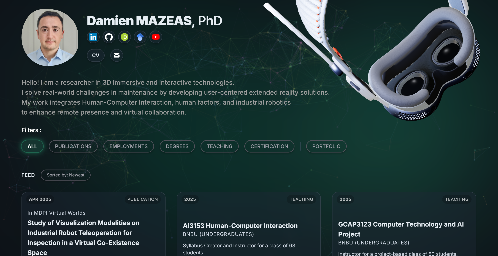

# 3D Interactive Portfolio Website

This is a personal portfolio website designed to showcase my work and skills in a visually engaging and interactive way. The site features a clean, modern design with a focus on 3D animations and a dynamic user experience.



## Features

- **Interactive 3D Model:** A 3D model of an Apple Vision Pro headset is rendered using Three.js and reacts to user interactions.
- **Smooth Scrolling Animation:** The 3D model smoothly animates out of view as the user scrolls down the page.
- **Random Rotation on Filter:** The 3D model rotates to a new random orientation each time a portfolio filter is selected.
- **Dynamic Filtering:** The portfolio items can be filtered by category with smooth transitions.
- **Responsive Design:** The website is fully responsive and works on all devices.

## Technologies Used

- **HTML5**
- **CSS3** with Tailwind CSS
- **JavaScript (ES6 Modules)**
- **Three.js** for 3D rendering and animations

## Running Locally

To run this project locally, you will need to have a local web server to handle the JavaScript module loading correctly.

1. **Clone the repository:**
   ```bash
   git clone https://github.com/mazeasdamien/DamienMazeas.git
   ```

2. **Navigate to the project directory:**
   ```bash
   cd DamienMazeas
   ```

3. **Start a simple Python web server:**
   ```bash
   python -m http.server
   ```

4. **Open your browser and navigate to:**
   ```
   http://localhost:8000
   ```

---
&copy; 2025 Damien Mazeas | Designed & Developed by the Author